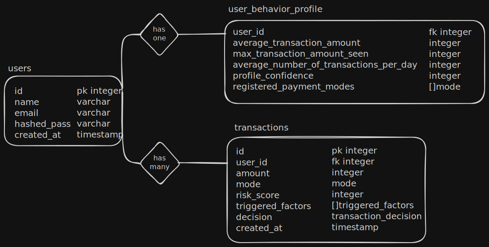

# Fraud Detection Lite

Fraud Detection Lite is a backend service that simulates a **fraud risk evaluation engine** acting as an intermediary between **transaction initiation** and **final acknowledgement**. It evaluates transactions in real time and classifies them based on risk using behavior-based heuristics.

## Overview

Each transaction is evaluated using **four fraud detection factors**:

1. **Amount Deviation** - Detects sudden deviations from the user's usual transaction amount.

2. **Frequency Spike** - Detects abnormal spikes in transaction frequency within a short time window.

3. **New Mode** - Detects usage of a payment mode that the user has not used before.

4. **Time Anomaly** - Detects transactions occurring at unusual hours compared to historical behavior.

Each factor contributes to a **risk score**. The cumulative risk score is then **dampened using a profile confidence score**, which represents how trustworthy a user is based on their historical transaction behavior.

## Transaction Decisions

Based on the final risk score, a transaction is classified into one of the following categories:

* **ALLOW** - Transaction proceeds normally.
* **FLAG** - Transaction is marked as potentially suspicious.
* **MFA_REQUIRED** - Transaction requires an additional authentication step.
* **BLOCK** - Transaction is rejected entirely.

## Transaction Modes accepted

* **UPI**
* **CARD**
* **NETBANKING**

## Profile Confidence

Profile confidence is calculated using the ratio of **allowed transactions to total transactions**. Higher confidence reduces the final risk score, allowing trusted users more flexibility while still detecting anomalies.

## Tech Stack

* **Go** – HTTP server and business logic
* **PostgreSQL (Docker)** – Primary database
* **Redis (Docker)** – In-memory token blacklist for logout (keeps the system RESTful)
* **goose** – Database migrations
* **sqlc** – Type-safe Go code generation from SQL

## Database Relations (ER Diagram)



## Prerequisites

* Go installed
* Docker and Docker Compose installed

## Running the Application Locally

### Clone the Repository

```bash
git clone https://github.com/cheemx5395/fraud-detection-lite.git
cd fraud-detection-lite
```

### Environment Setup

```bash
# Create a copy of the environment file
cp .env.sample .env
```

### Install Goose

```bash
go install github.com/pressly/goose/v3/cmd/goose@latest
```

### Start Dependencies

```bash
docker compose up -d
```

### Run Database Migrations

```bash
make migrationsDown   # may fail if tables do not exist
make migrationsUp
```

### Start the Server

```bash
make server
```

The server will start on:

```
http://localhost:<port>
```

## Background Job

A scheduled background job runs **every midnight** to rebuild and update user behavior profiles based on the previous day's transactions.

## API Documentation

All routes after login are **protected** and require a Bearer token in the `Authorization` header.

### Signup

**POST** `/signup`

**Request**

```json
{
  "name": "name",
  "email": "name@gmail.com",
  "mobile": "0123456789",
  "password": "name@123"
}
```

**Response**

```json
{
    "data": {
        "message": "Signup Success!",
        "id": 1
    }
}
```

### Login

**POST** `/login`

**Request**

```json
{
  "email": "name@gmail.com",
  "password": "name@123"
}
```

**Response**

```json
{
  "data": {
    "message": "Logged in Successfully",
    "token": "<JWT_TOKEN>"
  }
}
```

### Create Transaction

**POST** `/api/transactions`

**Headers**

```
Authorization: Bearer <token>
```

**Request**

```json
{
  "amount": 500,
  "mode": "UPI"
}
```

**Response**

```json
{
  "data": {
    "txn_id": 1,
    "decision": "ALLOW",
    "risk_score": 55,
    "triggered_factors": [
      "AMOUNT_DEVIATION",
      "NEW_MODE"
    ]
  }
}
```

### Get Transactions

**GET** `/api/transactions?limit=20&offset=0`

**Headers**

```
Authorization: Bearer <token>
```

**Response**

```json
{
  "data": [
    {
      "id": 1,
      "user_id": 1,
      "amount": 500,
      "mode": "UPI",
      "risk_score": 55,
      "triggered_factors": [
        "AMOUNT_DEVIATION",
        "NEW_MODE"
      ],
      "decision": "ALLOW",
      "created_at": "2026-01-22T12:31:34.429774"
    }
  ]
}
```

### Get Transaction

**GET** `/api/transactions/{id}`

**Headers**

```
Authorization: Bearer <token>
```

**Response**

```json
{
    "data": {
        "id": 11,
        "user_id": 1,
        "amount": 5500,
        "mode": "CARD",
        "risk_score": 82,
        "triggered_factors": [
            "AMOUNT_DEVIATION",
            "FREQUENCY_SPIKE",
            "NEW_MODE"
        ],
        "decision": "MFA_REQUIRED",
        "amount_deviation_score": 100,
        "frequency_deviation_score": 100,
        "mode_deviation_score": 60,
        "time_deviation_score": 5,
        "created_at": "2026-01-23T08:51:15.683128",
        "updated_at": "2026-01-23T08:51:15.683128"
    }
}
```

### Bulk Transaction Handling

**POST** `/api/transactions/upload`

**Headers**

```
Authorization: Bearer <token>
Content-Type: multipart/form-data
```

**Response**

```json
{
    "data": {
        "job_id": "811d11d8-1f9b-444d-a8c0-06f9b2c0220f",
        "status": "PENDING"
    }
}
```

### Status Bulk Transaction Progress

**POST** `/api/transactions/upload/{job_id}/status`

**Headers**

```
Authorization: Bearer <token>
```

**Response**

```json
{
    "data": {
        "job_id": "811d11d8-1f9b-444d-a8c0-06f9b2c0220f",
        "progress": {
            "failed": 0,
            "percent": 99,
            "processed": 1000,
            "success": 1000,
            "total": 1000
        },
        "status": "COMPLETED"
    }
}
```

### Logout

**POST** `/api/logout`

**Headers**

```
Authorization: Bearer <token>
```

**Response**

```json
{
  "data": {
    "message": "Logged out successfully"
  }
}
```

## Postman Collection

[postman collection](https://warped-meadow-913182.postman.co/workspace/New-Team-Workspace~850b93a7-4078-4f7e-bcb5-331e137d6e73/collection/32759292-e30aeed1-aeda-40a4-b7a1-dcbec4bad931?action=share&creator=32759292)